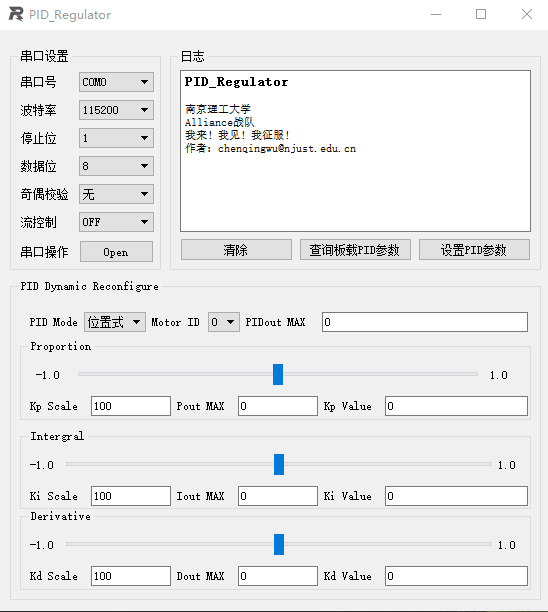

# PID_Regulator

PID_Regulator是一个旨在为[RoboMaster机甲大师](https://www.robomaster.com/zh-CN)参赛队员提供能够进行PID实时无线调参的解决方案，由[南京理工大学Alliance战队](https://mp.weixin.qq.com/s/pjrncS_X0_DEQYoD6yQVOw)提供技术支持。
# 概述
PID_Regulator主要包含以下三个部分的内容：

- PC端上位机（目前只提供免安装可运行文件，源码后期再开放）
- 蓝牙无线串口传输
- 以STM32为开发平台的下位机DEMO

功能实现

- V1.0 根据协议能够实现PID实时无线调参功能
- V1.2 修复一些bug,与STM32通信demo测试通过

TODO

- PID曲线显示
## PC端上位机

### 开发环境
- Windows 10
- Qt Creator 4.0.3 Based on Qt 5.6.1(MSVC 2013, 32 bit)
### 操作说明
- 硬件连接好PC和下位机
- 打开PID_Regulator.exe，打开串口即可进行数据传输
- 通过“串口设置”一栏可进行串口参数设置及操作
- 通过“PID Dynamic Reconfigure”一栏可进行PID参数设置
- 通过“日志”一栏可查看相关操作日志并进行PID参数设置与查询板载PID参数
- 剩余的操作请自行摸索
### 通信协议
参考[PID_Regulator_Protocol.pdf](https://github.com/jackychen227/PID_Regulator/blob/master/DOC/PID_Regulator_Protocol.pdf)
## STM32_DEMO
- 蓝牙串口通信
- 根据指定好的通信协议进行信息传输、解码与打包
- 参考[RoboMaster/RoboRTS-Firmware](https://github.com/RoboMaster/RoboRTS-Firmware)进行PID的参数结构体设计
## 蓝牙无线串口传输
### 硬件
#### 有线方案
- [USB转TTL CH340模块](https://s.taobao.com/search?q=USB%E8%BD%ACTTL+CH340%E6%A8%A1%E5%9D%97&imgfile=&js=1&stats_click=search_radio_all%3A1&initiative_id=staobaoz_20180527&ie=utf8)
#### 无线方案
- [无线蓝牙模块](https://s.taobao.com/search?q=%E6%97%A0%E7%BA%BF%E8%93%9D%E7%89%99%E6%A8%A1%E5%9D%97&imgfile=&commend=all&ssid=s5-e&search_type=item&sourceId=tb.index&spm=a21bo.2017.201856-taobao-item.1&ie=utf8&initiative_id=tbindexz_20170306)
- [绿联 USB蓝牙适配器4.0版接收器](https://item.jd.com/11078472771.html)(PC若自带蓝牙硬件支持则不用）

### 软硬件部署
初始化车载无线蓝牙串口之后，蓝牙模块与PC端蓝牙配对，之后可用正常的串口发送读取相关函数进行数据的无线传输，详细说明（TODO）

# 版权申明
NJUST Alliance. All rights reserved.

# Bless for NJUST Alliance!
# Veni! Vedi! Vici!

